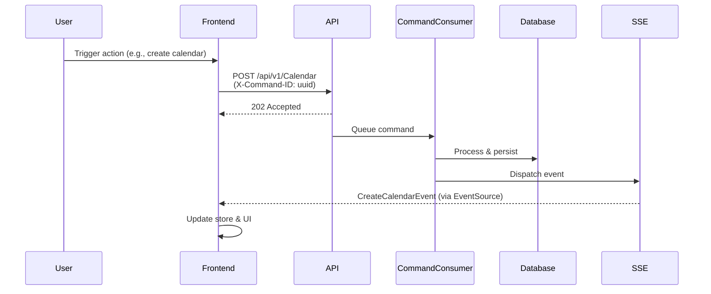

# Todo Calendar

A full-stack calendar and event management application built with .NET and Svelte.

## Tech Stack

| Layer | Technologies |
|-------|-------------|
| **Backend** | .NET 10, ASP.NET Core, PostgreSQL, Entity Framework Core |
| **Frontend** | Svelte 5, TypeScript, Tailwind CSS, Vite |
| **Patterns** | CQRS, Server-Sent Events (SSE) |

## Project Structure

```
Frontend/      Svelte 5 SPA (components, stores, routing)
App/           ASP.NET Core Web API (controllers, entry point)
Application/   Business logic, CQRS command/query handlers
Presentation/  API contracts, DTOs, service interfaces
Domain/        Entity models
Database/      EF Core DbContext and migrations
Test/          Integration tests
```

## Architecture: CQRS + SSE Flow

The application uses CQRS (Command Query Responsibility Segregation) with Server-Sent Events for real-time synchronization across clients.



**Key points:**
- Commands return immediately (202 Accepted) for responsive UI
- Commands are processed asynchronously via a background consumer
- SSE broadcasts events to all connected clients for real-time sync
- Frontend correlates responses using `X-Command-ID` header

---

## Development Environment

### PostgreSQL Setup

Create this folder or modify the Docker run command path:

```bash
C:\DockerVolumes\Database
```

Start the database container:

```bash
docker run -d --name postgres-db -e POSTGRES_USER=admin -e POSTGRES_PASSWORD=admin123 -e POSTGRES_DB=mydatabase -v C:/DockerVolumes/Database/postgres-data:/var/lib/postgresql/data -p 5432:5432 postgres:17
```

### Login Test URI

```
http://localhost:5220/api/v1/Auth/Login/Test?SuccessRedirectUrl=http%3A%2F%2Flocalhost%3A5035%2Fapi%2Fv1%2Ftest&ErrorRedirectUrl=http%3A%2F%2Flocalhost%3A5035%2Ferror
```

---

## Entity Framework Commands

### Install EF Core CLI tool

```bash
dotnet tool install --global dotnet-ef
```

Or update an existing installation:

```bash
dotnet tool update --global dotnet-ef
```

### Create a migration

```bash
dotnet ef migrations add InitialCreateTodo --project ./App
```

### Apply migrations to database

```bash
dotnet ef database update --project ./App
```

---

## Testing

### Useful date strings

```
2025-10-18T15:00:00.00Z
```
